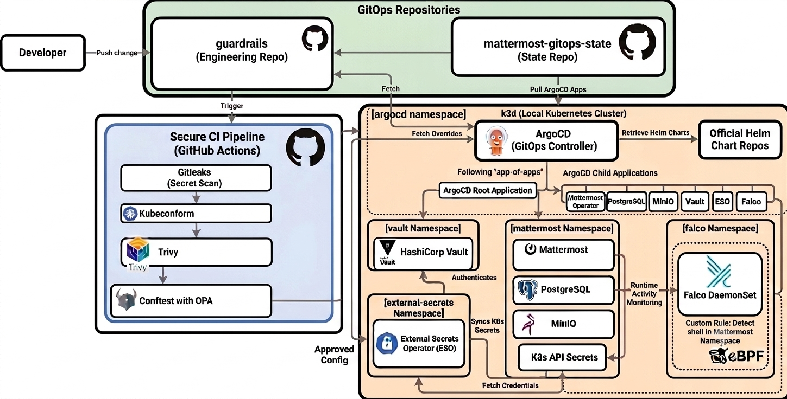

# Guardrails - GitOps Security Pipeline for Mattermost on Kubernetes
<div align="center">


</div>

A GitOps platform deploying Mattermost on Kubernetes with a pre-sync guardrail pipeline that validates every change **before ArgoCD ever touches the cluster**. The cluster only runs what has passed policy, schema, and vulnerability checks.

## The Problem This Solves

Most GitOps setups work like this: a developer pushes a change to the deployment repo, ArgoCD detects it and syncs it to the cluster. Clean, automated, fast.

But what if the change contains a leaked secret? A misconfigured service that exposes a database publicly? A container image with a critical CVE? A manifest that violates your security baseline?

ArgoCD doesn't know. It syncs whatever is in git.

**This project builds the layer that runs before ArgoCD sees anything**: a guardrail pipeline that automatically validates every change across four independent security checks before it can ever reach the cluster. The cluster only ever runs what has been explicitly approved by policy, schema, and vulnerability checks.


---
## Architecture



---
## Two-Repo Structure

The project is split across two repositories with a deliberate separation of concerns:

**`guardrails`** (this repo) is the engineering repo. Contains:
- Helm values overrides for every deployed component
- OPA/Rego security policies
- The GitHub Actions guardrail pipeline
- Vault and External Secrets configuration
- Documentation

**[`mattermost-gitops-state`](https://github.com/amalsboui/mattermost-gitops-state)** is the cluster state repo. Contains only ArgoCD Application manifests. This is the single source of truth for what should be running in the cluster. ArgoCD watches this repo and reconciles the cluster to match it continuously.

The pipeline runs on the `guardrails` repo. ArgoCD watches the `mattermost-gitops-state` repo. These two concerns never mix. CI never touches the cluster directly, and ArgoCD never runs application logic.

---
## How ArgoCD Manages the Platform

ArgoCD runs in the `argocd` namespace and uses the **app-of-apps pattern**: one root Application watches the state repo and automatically discovers every child Application. Adding a component means adding one manifest to the state repo and pushing.

Each Application points at a different source depending on what it manages:
- **Upstream infrastructure** (Mattermost Operator, PostgreSQL, MinIO, Vault, Falco, ESO) syncs from official Helm repos pinned to exact chart versions
- **Platform configuration** (Vault ClusterSecretStore, ExternalSecrets) syncs from the `vault/` directory of this repo

Any manual change to the cluster is automatically reverted. Every cluster state change has a git commit.
**Application tree:**

```text
ArgoCD Root Application
ArgoCD Root Application

├── app/
│   ├── mattermost    → helm.mattermost.com
│   ├── postgres      → charts.bitnami.com
│   └── minio         → charts.min.io
│
├── vault/
│   ├── vault         → helm.releases.hashicorp.com
│   └── vault-config  → guardrails/vault/
│
├── eso/
│   └── external-secrets → charts.external-secrets.io
│
└── falco/
    ├── falco         → falcosecurity.github.io/charts
    └── falco-rbac    
```

---

## Cluster Namespaces

| Namespace | What runs there |
|-----------|----------------|
| `mattermost` | Mattermost app, PostgreSQL, MinIO |
| `argocd` | ArgoCD GitOps controller |
| `vault` | HashiCorp Vault |
| `external-secrets` | External Secrets Operator |
| `falco` | Falco runtime security DaemonSet |

---

## The Guardrail Pipeline

Every Pull Request to `main` triggers four automated checks that run in parallel. ArgoCD watches only the `main` branch with automated sync enabled, meaning a change can only reach the cluster after it passes all checks and is merged.

| Check | Tool | What it catches |
|-------|------|----------------|
| Secret scanning | gitleaks | Leaked credentials in git diffs |
| Schema validation | kubeconform | Invalid k8s manifests that kubectl would reject |
| Misconfiguration scanning | Trivy | CVEs and config issues in images and manifests |
| Policy enforcement | Conftest + OPA | Violations of the project security baseline |

**OPA policies enforced:**

| Policy | Rule |
|--------|------|
| No root containers | `runAsNonRoot: true` required |
| Resource limits | CPU and memory limits mandatory |
| No privileged containers | `privileged: true` always blocked |
| No NodePort services | External access via ingress only |
| No LoadBalancer services | Same, no direct cloud LB exposure |
| No hardcoded secrets | Sensitive env vars must use SecretKeyRef |

Known upstream chart violations that cannot be remediated are documented in [EXCEPTIONS.md](./EXCEPTIONS.md) with accepted risk rather than silently ignored.

---

## Secrets Management

No secret exists in git or in a manually created Kubernetes Secret.

**Flow:**

1. Secret stored in Vault (single source of truth)
2. ExternalSecret resource tells ESO what to sync and where
3. ESO authenticates to Vault using the pod's ServiceAccount token, no static credentials
4. ESO creates and keeps the Kubernetes Secret in sync automatically
5. Application pods consume the Secret normally

Vault uses the Kubernetes auth method. Pods prove identity via their ServiceAccount JWT, which Vault verifies against the cluster API. The ExternalSecret resources are managed by ArgoCD from the `vault/` directory of this repo.

---

## Runtime Security - Falco

Falco runs as a DaemonSet using eBPF to monitor syscalls inside every running container. While the pipeline prevents bad config from reaching the cluster, Falco catches exploitation of vulnerabilities in already-running applications, something static analysis cannot do.

A custom rule alerts when any process spawns a shell inside the `mattermost` namespace. It is the first signal of a container escape or unauthorized exec access.

---

## Demo Scenarios

Five deliberate misconfigurations, each caught by a different layer:

| Scenario | Introduced | Caught by |
|----------|-----------|-----------|
| 1 | GitHub token in a values file | gitleaks |
| 2 | Invalid field name in a manifest | kubeconform |
| 3 | Upstream chart misconfiguration | Trivy |
| 4 | NodePort service exposing the database | Conftest |
| 5 | Shell spawned inside a running pod | Falco |

---

## Getting Started

**Prerequisites:** Docker, k3d, kubectl, Helm, ArgoCD CLI, Vault CLI

**Bootstrap:**
```bash
k3d cluster create guardrail --agents 2
kubectl create namespace argocd
kubectl apply -n argocd -f https://raw.githubusercontent.com/argoproj/argo-cd/stable/manifests/install.yaml

# Last manual apply, ArgoCD manages everything after this
kubectl apply -f https://raw.githubusercontent.com/amalsboui/mattermost-gitops-state/main/apps/root.yaml
```

**Vault initialization** (one-time, after Vault pod is Running, see [vault-setup.md](vault-setup.md))

---

## Stack

| Tool | Role |
|------|------|
| k3d | Local Kubernetes cluster inside Docker |
| ArgoCD | GitOps CD with app-of-apps pattern |
| Mattermost Operator | Manages Mattermost via CRD |
| PostgreSQL | Database (Bitnami chart) |
| MinIO | S3-compatible file storage |
| HashiCorp Vault | Secrets management |
| External Secrets Operator | Syncs Vault secrets into k8s |
| Falco | Runtime security via eBPF |
| gitleaks | Secret scanning |
| kubeconform | Manifest schema validation |
| Trivy | CVE and misconfiguration scanning |
| Conftest + OPA | Policy-as-code enforcement |